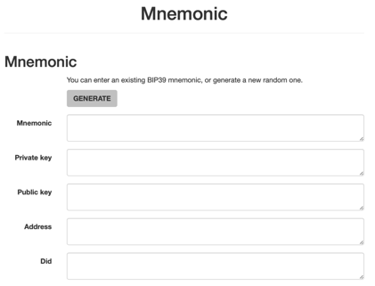
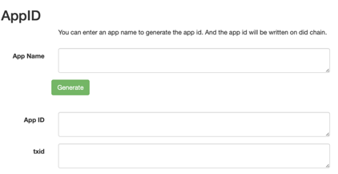
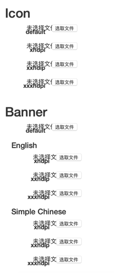
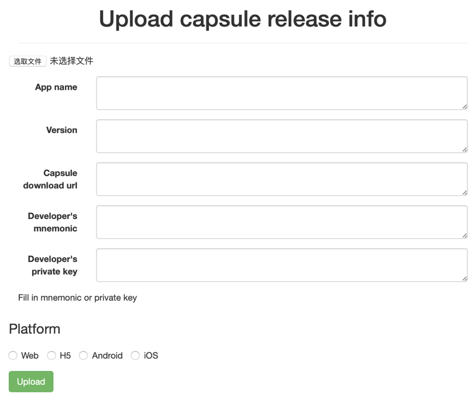

# MiniProgram development process and tool description

## MiniProgram development process
***

1. Apply for a developer account.[Genrate Developer account](###Generate%2Ddeveloper%2Daccount)
2. Give mini program a name and generage a unique ID(AppID).[Generate AppID](###Generate%2DAppID)
3. Mini program development.
4. Fill in infomation, genrate .capsule file.[Genrate capsule](###Generate%2DCapsule)
5. Release mini program, deploy the download link of the capsule file and upload infomation to DID chain.[Release capsule](###Release%2DCapsule%2DInfo)

## Capsule Tool
***
### Tool page introduction

[link](https://zuohuahua.github.io/Elastos.Tools.Creator.Capsule/)

The tool is divided into three tabs, Mnemonic, Generate Capsule, Upload Capsule info

1. Mnemonic tab is used to generate developer account, generate the AppID and up to DID chain, verify signature.
2. Generate Capsule tab is used to generate Capsule file.
3. Upload Capsule info tab is used to up mini program release information to DID chain.

### Generate developer account

Click the GENRATE button to generate a new account.

If there is a developer account, fill in the mnemonic input box, the following content will be automatically derived.

### Generate AppID

Enter AppName, click the Generate button below, the AppID will be generated, and the AppID will be up to DID chain at the same time. After the transaction is sent, the txid will be displayed on the page.

### Generate capsule

The capsule file contains five parts, and the red word with * is required. After all the information is filled , click the Done button at the bottom to generate the capsule file.

1. App Info: Mini program name and App ID.
2. Developer Info: Developer information.
3. Icon: Mini program icon, display in list mode.
4. Banner: Mini program background, display in card mode.
5. Detail Info: Detail info, url, description, category etc.
6. Release Info: Version related information, version number, release information, etc.

#### App Info

The first three items are the names of mini program. Currently, only Simplified Chinese and English are supported. If the corresponding language is not found, Default will be used. Default and AppID are required.

AppID must match the information on DID chain.

Default must be the name of the generated AppID.

#### Developer Info

Developer information is required, filled in the developer's DID and PublicKey, must match the developer information when generating AppID.

#### Icon & Banner

Both Icon and Banner have three resolution settings and default settings. If the file cannot be found under the corresponding resolution, default is used.

Banner can also set different images according to the language, currently only supports English and Simplified Chinese.

#### Detail Info

Notification url: Mini program notification link.

Short description: Mini program simple description, support Chinese and English, if there is no suitable option in the current language with default.

Long description: Mini program long description, support Chinese and English, if there is no suitable option in the current language with default.

Category: Mini program category, single choice, required.

Platform: Mini program platform, single choice, required.

#### Release Info

Version: Mini program version, required.

ReleaseNote: Mini program release note.

Url: Web mini program indicates website, H5 mini program  indicates download link, required.

H5 file hash：H5 mini program file hash.

Capsule file name：capsule file name

Click the Done button to generate capsule file.

### Release Capsule Info

Select the capsule file, fill in the App name, Version information, and must match the information in the capsule file.

Fill in the download link of the capsule file, please deploy it in advance.

Fill in developer information, mnemonic or private key

Platform information must match that in the capsule file.

Click the Upload button to upload release info. After the transaction is sent, the txid will be displayed below.

