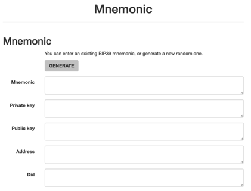
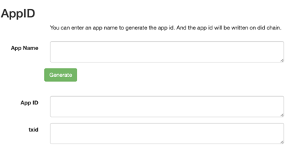
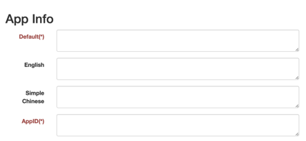
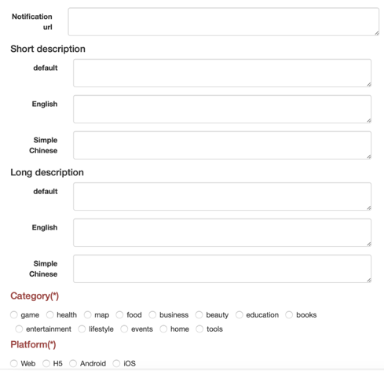
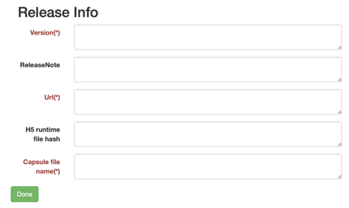
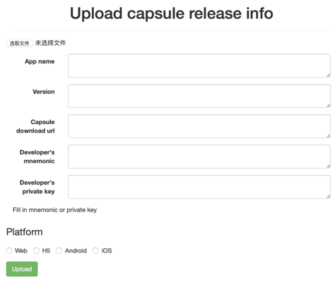

# 小程序开发流程及工具说明

## 小程序开发流程
***

1. 申请一个开发者账号，[生成开发者账号](###生成开发者账号)
2. 给小程序起个名字，生成一个唯一的ID标识（AppID）[生成AppID](###生成AppID)
3. 小程序开发
4. 生成capsule文件，填入必要的信息，[生成Capsule文件](###生成Capsule文件)
5. 发布小程序，部署好capsule文件的下载链接，将capsule信息上链，[发布Capsule信息](###发布Capsule信息)

## Capsule工具
***
### 工具页面介绍

[工具地址](https://zuohuahua.github.io/Elastos.Tools.Creator.Capsule/)

工具分为三个Tab，Mnemonic, Generate Capsule, Upload Capsule info

1. Mnemonic的页面用于生成开发者账号，生成AppID并上链，校验签名信息
2. Generate Capsule用于生成Capsule文件，填入小程序相关信息即可生成
3. Upload Capsule info用于上链小程序发布信息

### 生成开发者账号

如果还没有开发者账号，点击GENRATE按钮直接生成。

如果已有开发者账号，将助记词填入Mnemonic对应的输入框中，下面的内容会自动派生。

### 生成AppID

输入AppName，点击下方的Generate按钮，会生成App ID，并同时将AppID上链。上链成功之后，会将txid显示在页面上。

### 生成Capsule文件

Capsule文件一共包括五个方面的内容，红色字带*的是必填项。所有信息填好之后，填入capsule文件名称，点击底部的Done按钮即可生成capsule文件

1. App Info：小程序名称及ID
2. Developer Info：开发者信息
3. Icon：小程序图标，列表模式显示的时候用
4. Banner：小程序卡片背景，卡片模式显示的时候用
5. Detail Info：小程序详细信息，url，描述，分类等
6. Release Info：版本相关信息，版本号，发布信息等

#### App Info

前面三项都是小程序的名称，目前仅支持简体中文和英文，如果对应语言找不到，会使用Default。Default 与AppID是必填项。

AppID必须与链上信息一致。

Default必须是生成AppID的时候，输入的名称。

#### Developer Info

开发者信息都是必填项，填入开发的DID和PublicKey，必须与生成AppID时填入的开发者信息一致。

#### Icon & Banner

Icon和banner都是有三种分辨率的设置和default的设置，如果对应的分辨率下找不到文件，则使用default。

banner还可以根据语言设置不同的图片，目前仅支持英文和简体中文。

#### Detail Info

Notification url：小程序通知消息链接

Short description：小程序简单描述，支持中英文，如果当前语言下没有合适的选项用default

Long description：小程序详细描述，支持中英文，如果当前语言下没有合适的选项用default

Category：小程序的类别，单选，必填项

Platform：发布的小程序平台信息，单选，必填项

#### Release Info

Version：小程序版本号信息，必填项

ReleaseNote：版本发布说明

Url：Web小程序指示网站地址，H5小程序指示下载链接，必填项

H5 file hash：H5小程序的文件hash

Capsule file name：生成的capsule文件名称

点击Done按钮生成capsule文件

### 发布Capsule信息

选择capsule文件, 填入App name，Version信息，必须与capsule中的信息一致。

填入capsule文件的下载链接，请提前部署好

开发者账号信息，mnemonic或者private key任选一个

Platform信息的选择必须与capsule文件中的一致

以上信息都填好以后点击Upload上链小程序的发布信息，上链成功以后会在下方显示txid

