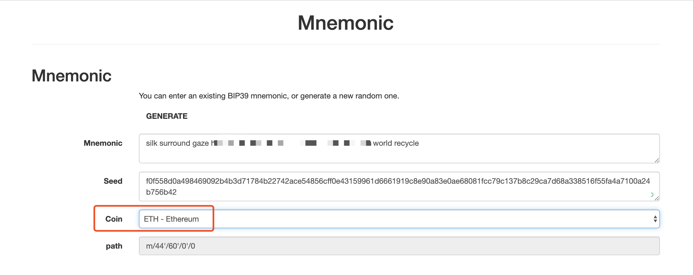
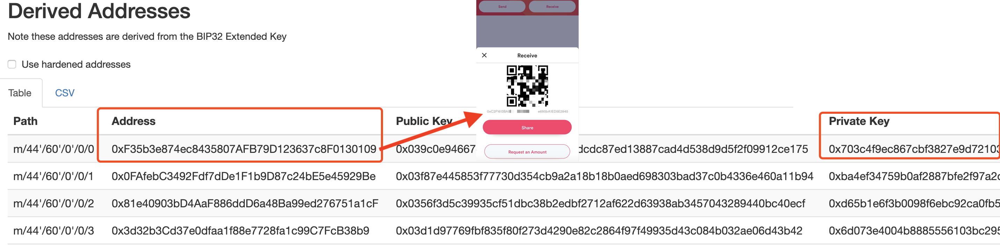
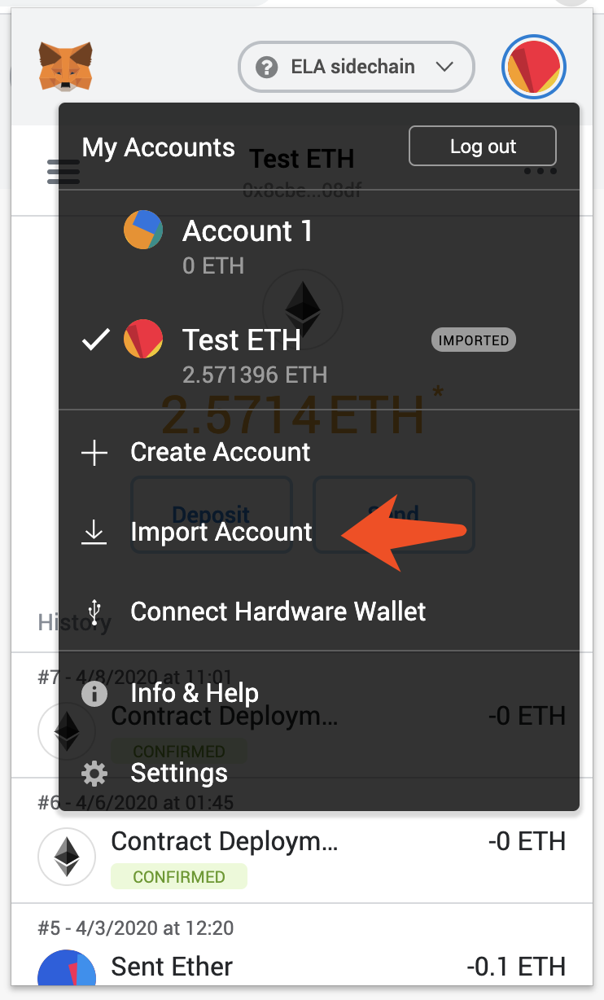
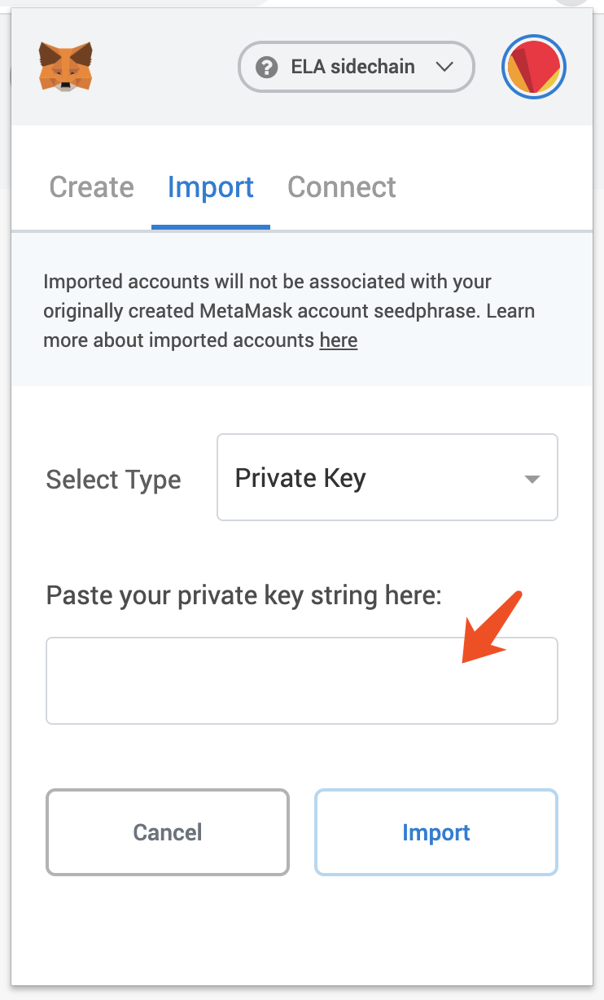
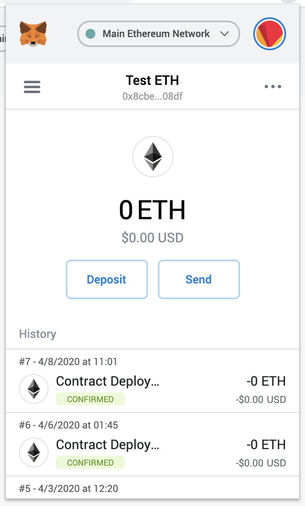
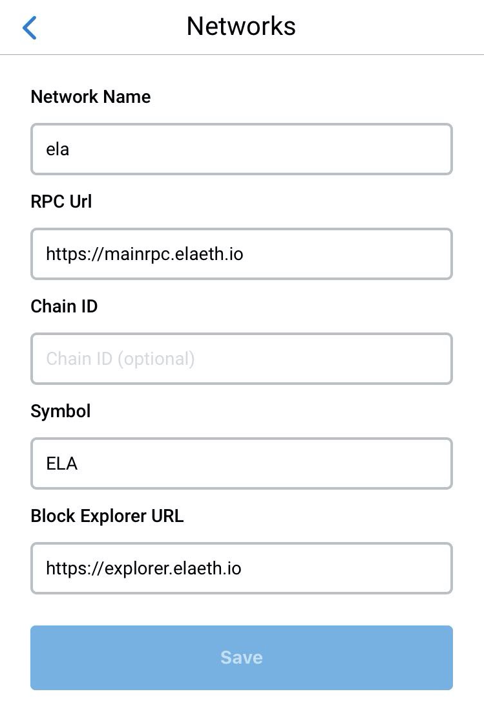
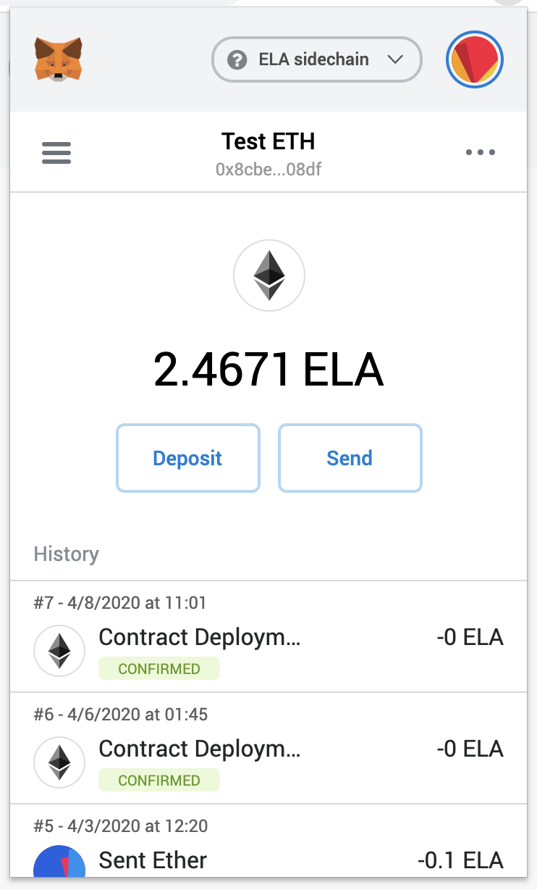

# Use Elaphant and Metamask together

Hello everyone, this article will describe a method that allows you to export Elaphant's private key and operate Elaphant's ETH assets and Elastos Eth sidechain assets in Metamask. On the one hand this helps to protect the security of your assets, there can be multiple wallets to restore assets. On the other hand, you can use Metamask to use more dapps.

## Import to the Metamask wallet

1. You can open below URL in your browser

   https://elaphant.app/mnemonic.html

2. Enter your mnemonic and switch the "coin" to ETH

3. Check the "Derived Addresses" list, the first address should be your ETH address in the Elaphant, please confirm it.

4. If the "Step 3" is ok, then copy the Private Key of the first record

5. Open the Metamask and open the Account menu.

6. Click the "Import account".

7. Paste the Private Key in the input field.

8. Click "Import" button to finish importing, you can see your ETH in the Metamask wallet.

9. Enjoy it!

## Setup Metamask to support Elastos eth sidechain

1. Click the "Networks" menu and select the "Custom RPC".

2. Please enter below parameters:

3. Click "Save" and fresh the network again.

4. You can switch ETH and ELA with the "Networks" menu, enjoy it!

