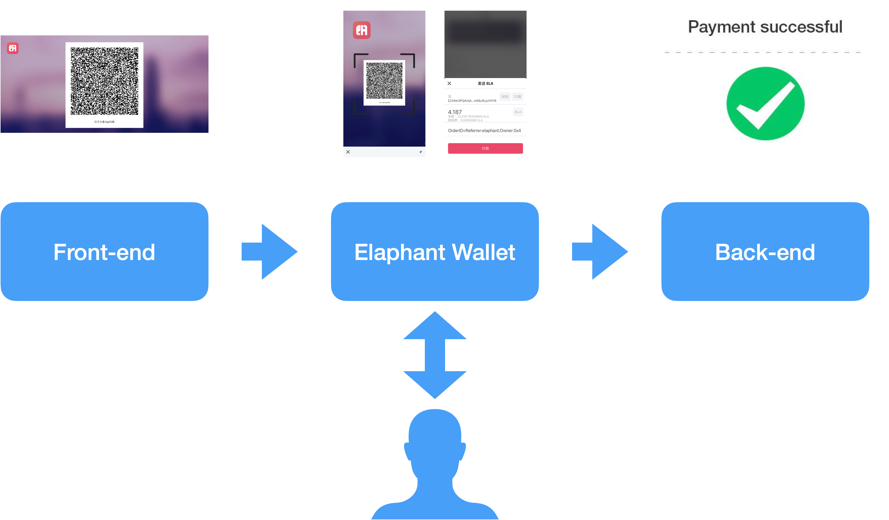

# How to use Elaphant payment


### Payment steps

1. The seller generates the URL for payment, if on the PC it will show a QR code. If on the mobile it will launch the Elaphant App. The seller can set a callback URL for payment notification when the buyer paid the money.
2. The buyer should confirm the amount and submit it.
3. The backend service received the message via an API call.




### Generate the payment URL

```var returnUrl = <Your front end URL>;
//////// Don't change below info ////////
window.ela_developerDID = "ibxNTG1hBPK1rZuoc8fMy4eFQ96UYDAQ4J";
window.ela_appID = "ac89a6a3ff8165411c8426529dccde5cd44d5041407bf249b57ae99a6bfeadd60f74409bd5a3d81979805806606dd2d55f6979ca467982583ac734cf6f55a290";
window.ela_appName = "Mini Apps";
window.ela_publicKey = "034c51ddc0844ff11397cc773a5b7d94d5eed05e7006fb229cf965b47f19d27c55";

//////// Please input your info ////////
var orderID = "A string, you can put it with any thing you want to trace";
var elaphantURL = "elaphant://elapay?DID=" + window.ela_developerDID +
 "&AppID=" + window.ela_appID +
 "&AppName=" + encodeURIComponent(window.ela_appName) +
 "&Description=" + encodeURIComponent(window.ela_appName) +
 "&PublicKey="+ window.ela_publicKey +
 "&OrderID=" + orderID +
 "&CoinName=ELA"+
 "&ReceivingAddress=" + <Your ELA Address> +
 "&Amount=" + <ELA Amount> +
 "&ReturnUrl=" + encodeURIComponent(returnUrl);
 //"&CallbackUrl=" + encodeURIComponent(callbackUrl); // you can also callback to the backend service api

var url = "https://launch.elaphant.app/?appName="+encodeURIComponent(window.ela_appTitle)+
 "&appTitle="+encodeURIComponent(window.ela_appTitle)+
 "&autoRedirect=True&redirectURL="+encodeURIComponent(elaphantURL);
window.location.href = url;
```

### Sample


```
https://launch.elaphant.app/?appName=CryptoName&appTitle=CryptoName&autoRedirect=True&redirectURL=elaphant%3A%2F%2Felapay%3FDID%3DibxNTG1hBPK1rZuoc8fMy4eFQ96UYDAQ4J%26AppID%3Dac89a6a3ff8165411c8426529dccde5cd44d5041407bf249b57ae99a6bfeadd60f74409bd5a3d81979805806606dd2d55f6979ca467982583ac734cf6f55a290%26AppName%3DMini%2520Apps%26Description%3DMini%2520Apps%26PublicKey%3D034c51ddc0844ff11397cc773a5b7d94d5eed05e7006fb229cf965b47f19d27c55%26OrderID%3DReferrer%3Aelaphant%3BOwner%3A0x40da0e9AD0f40A6e26eC03c49eCCec01e2B8f9d4%3BData%3AeyJuYW1lIjoiYWJjZGUiLCJkaWQiOiJpZVM3NFZadzh2UDlBY252a3NleVY5Qlh3UjZtNTRMRndpIiwicHVibGlja2V5IjoiMDMwZWMyNWNmZDRhNTg0ZmRhODA0ZjIxYzg3YTk1OGUyNjE2MWM4MmQ3MjA2NmQ5MjMyN2UyYWZhNDc4OWQyOWFlIiwiZWxhLmFkZHJlc3MiOiJFWUg2OXJSQWZEUTJIUmEzNWJtWVJoNlVvQVo4dTNuN1pKIiwiYnRjLmFkZHJlc3MiOiIxSmtuQVhSVW9rUDNBcm5KTDM3MWp1eVpRZndVZWFLbUw2IiwiZXRoLmFkZHJlc3MiOiIweDQwZGEwZTlhZDBmNDBhNmUyNmVjMDNjNDllY2NlYzAxZTJiOGY5ZDQiLCJlbWFpbCI6IiJ9%26CoinName%3DELA%26ReceivingAddress%3DEZAMcSPQAmjAWEBi41z2edmS6u9LjuVNYB%26Amount%3D4.187%26ReturnUrl%3Dhttps%253A%252F%252Fcryptoname.elaphant.app%252F%253Fnew%253Dabcde
```


